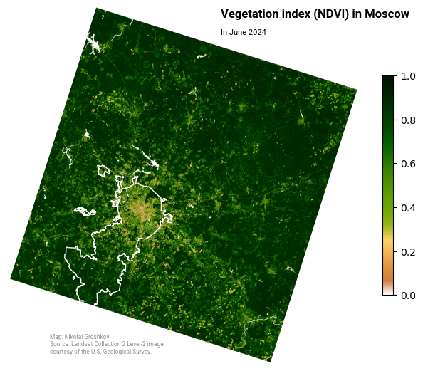
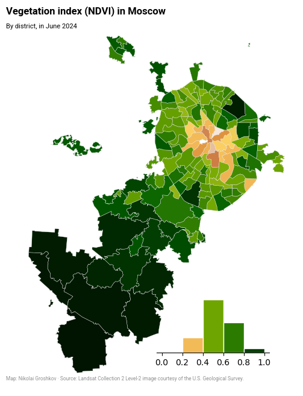

# Moscow Vegetation Analysis

This project calculates the NDVI (Normalised Difference Vegetation Index) for the districts of Moscow (Russia) in June 2024. The analysis is based on Landsat 8-9 OLI/TIRS C2 L2 sensor data.
Include the USGS credentials required to download the Landsat data in the `.env` file.

In addition, the difference between NDVI indices is calculated using gee and geemap. Water areas found by the MNDWI index (>0.5) are excluded from the analysis.

Libraries and tools used: shapely, rasterio, geopandas, pystac_client, rasterstats, Google Earth Engine

